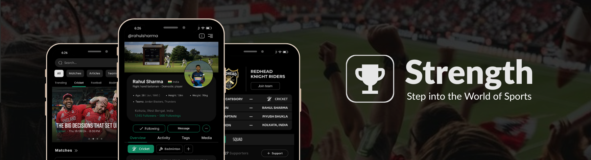
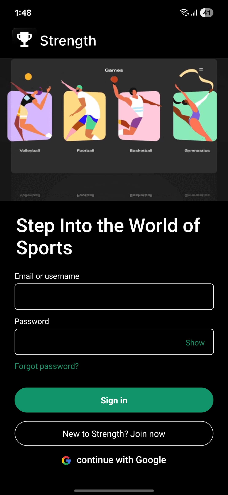
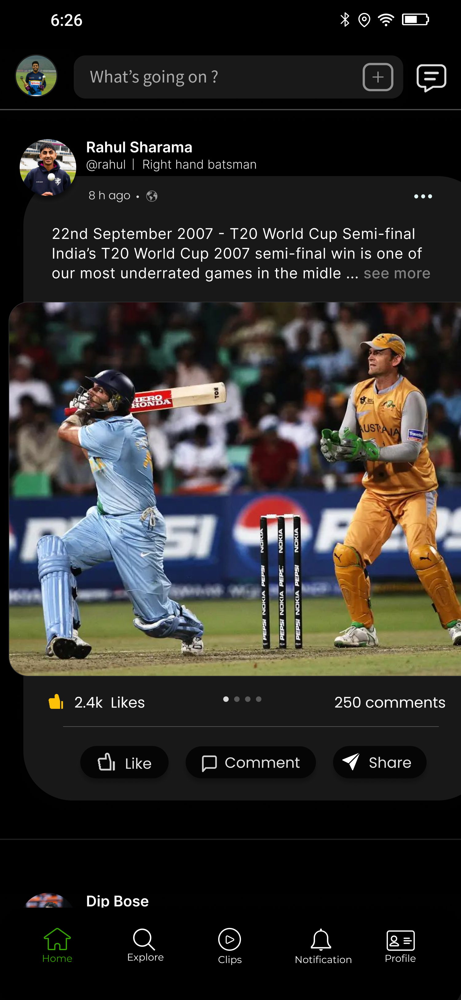
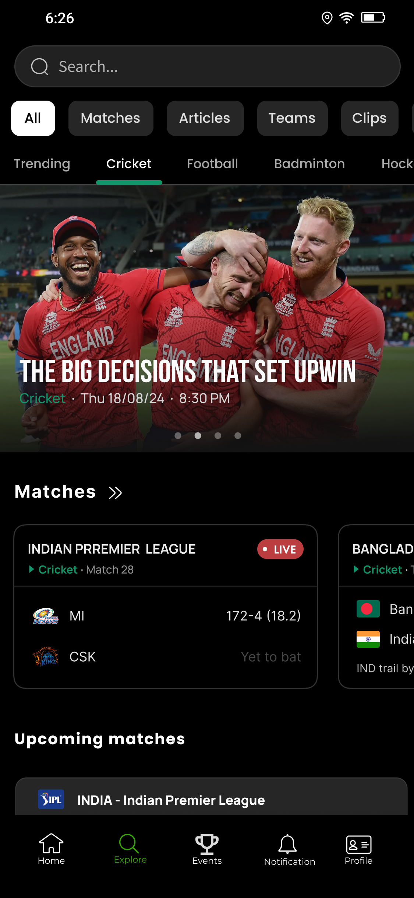
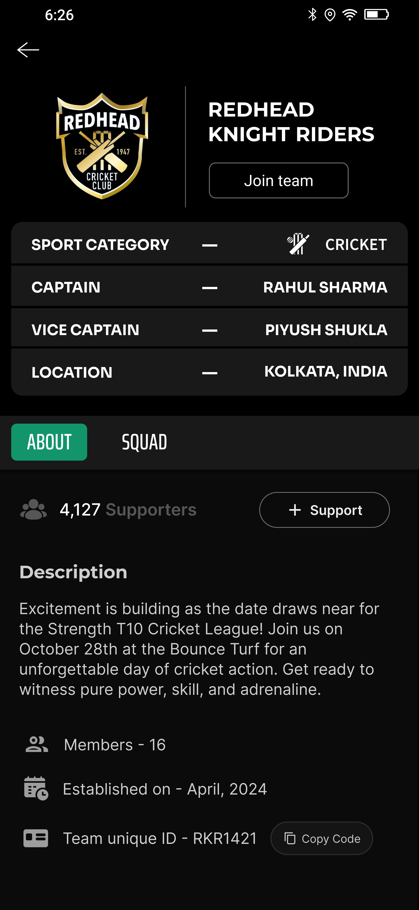
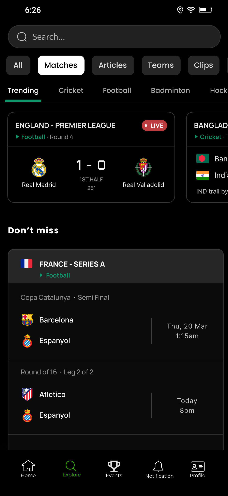
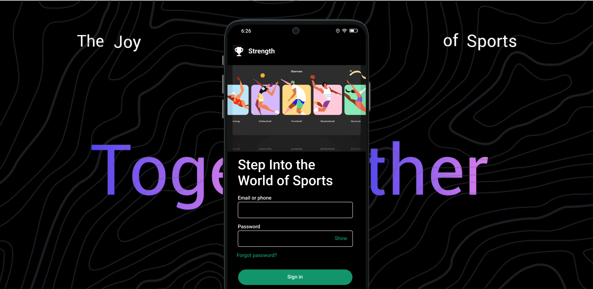

<p align="center">
  
</p>

# Strength

## Professional Social Media Platform for Sports

**Strength** is a professional sports-focused social media platform designed to connect athletes, clubs, teams, and sports enthusiasts in a single digital ecosystem.

The platform addresses real challenges in the sports community by enabling structured sports profiles, team collaboration, performance visibility, and meaningful engagement. Strength empowers users to showcase their sporting identity, connect with like-minded athletes, follow teams, participate in discussions, and stay updated with live sports content — all in one place.

Unlike generic social platforms, Strength is built **specifically for sports**, emphasizing athlete identity, role-based sports data, team culture, and performance-centric interaction.

---

## 📸 Screenshots / Demo

<p align="center">
  
  
  
</p>

**Authentication & Profile Creation**  
Strength provides a secure signup and login experience, followed by structured profile creation. Users build a professional sports profile including personal details, favorite sports, sport-specific roles, physical attributes, and profile media. This information becomes the foundation of their sports identity across the platform.

<br />
<br />

<p align="center">
  
  
  
</p>

**Posts & Community Interaction**  
Users can create rich posts including images, videos, polls, and multi-media content. The feed supports likes, comments, replies, sharing, and reporting, enabling real community-driven sports interaction.

<p align="center">
  
</p>

---

## ✨ Features

### 🔐 Authentication & Account Management
- Secure user signup and login  
- Account settings & profile management  
- User-initiated account deletion  
- Session-based authentication flow  

### 👤 Professional Sports Profile
- Profile picture and cover image  
- Favorite sports selection  
- Sport-specific role details (examples):
  - **Cricket**: Batsman, Bowler, Left/Right Hand  
  - **Football**: Midfielder, Goalkeeper, Defender  
- Physical attributes:
  - Height (cm / m / ft)  
  - Weight (kg / lbs)  
  - Age  
- Sports identity prominently displayed on profile  

### ⚙️ Profile & Privacy Settings
- Edit profile information  
- Update sports preferences  
- Control personal profile visibility  
- Block users  
- Report users for inappropriate behavior  

### 📝 Posts & Content Creation
- Multiple post types:
  - Single image  
  - Multiple images  
  - Videos  
  - Polls  
- Image & video ratio and size variations  
- Like, comment, reply, and share posts  
- Quick action menu for core post features  

### 💬 Community Interaction
- Follow / unfollow users  
- Search users globally  
- Comment replies & threaded discussions  
- Report posts for moderation  

### 👥 Teams & Clubs
- Create sports teams  
- Join existing teams  
- Team-based identity and collaboration  
- Designed for clubs, local teams, and academies  

### 🔎 Explore & Discovery
- Live scores for major sports (top 4 supported)  
- Sports news articles  
- Discover athletes, teams, and trending posts  

### 🔔 Notifications
- Real-time notifications for:
  - Likes  
  - Comments  
  - Follows  
  - Team activity  
- Dedicated notification page  

---

## 🧠 How Strength Works (High Level)

1. User signs up and creates a sports profile  
2. Favorite sports and role-based details are selected  
3. User creates or joins teams  
4. Posts and interactions build community engagement  
5. Explore section provides live scores and sports news  
6. Notifications keep users informed of all activity  

---

## 🏗️ Architecture Overview

Strength follows a **monolithic backend architecture** using the **MVC design pattern**, optimized for early scalability and maintainability.

```text
React Native Mobile Application
            |
            | REST APIs
            v
Strength Backend (Node.js / Express)
            |
            | MVC Architecture
            v
MongoDB / Redis / Background Jobs
🛠️ Tech Stack
📱 Frontend
React Native

Redux Toolkit (state management)

TypeScript

Zod (schema validation)

🌐 Backend
Node.js

Express.js

REST API architecture

MVC design pattern

Monolithic architecture

🗄️ Database & Caching
MongoDB

Redis (caching & performance optimization)

⚙️ Background Processing
BullMQ (job queues & async tasks)

☁️ Infrastructure & DevOps
Docker (backend containerization)

AWS EC2 (deployment)

AWS S3 (media storage)

🧪 Core Language
JavaScript (primary language across the stack)

⚙️ Setup & Installation (Local)
# Clone repository
git clone <strength-repo>

# Backend
cd backend
npm install
npm run dev

# Frontend
cd ../frontend
npm install
npx react-native run-android
# or
npx react-native run-ios
Environment variables and production configuration will be documented separately.

🚀 Usage
Create a professional sports profile

Follow athletes and teams

Share sports content through posts

Engage via likes, comments, and replies

Track live scores and sports news

Manage teams and community presence

🧩 Key Design Decisions
Sports-first platform (not a generic social network)

Role-based sports profiles for authenticity

Monolith architecture for faster iteration

REST APIs for client flexibility

Dockerized backend for deployment consistency

📈 Scalability & Performance
Redis caching for frequently accessed data

BullMQ for async tasks

Optimized REST APIs

AWS infrastructure for horizontal scaling

🛣️ Roadmap / Future Improvements
Advanced player performance analytics

Tournament hosting & management

Verified athlete & club profiles

In-app messaging

Microservices extraction if required

📄 License
MIT License (to be finalized)

👤 Author
Ravi Sharma
Software Engineer | Full-Stack & Hybrid App Developer